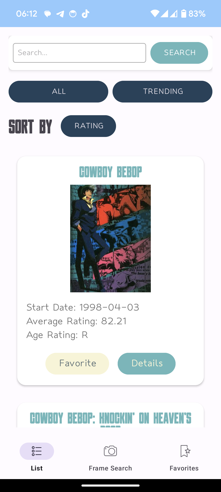
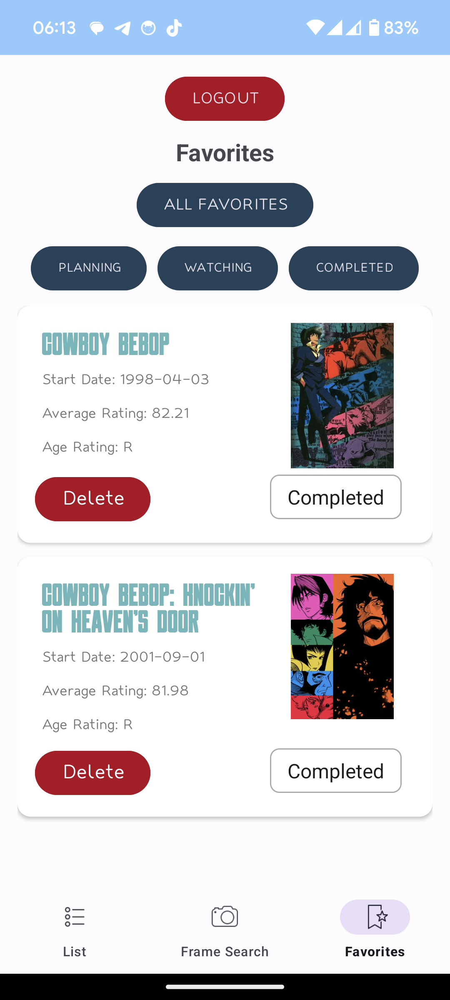
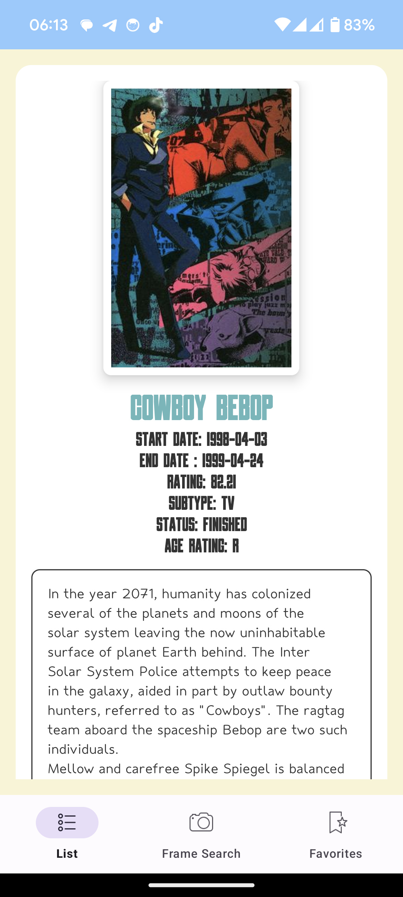
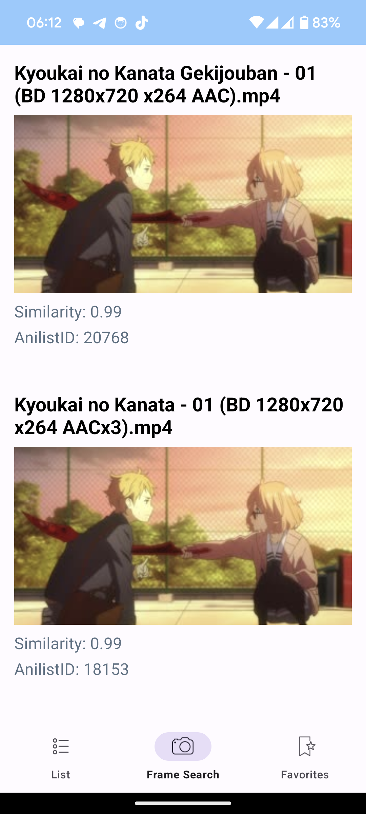
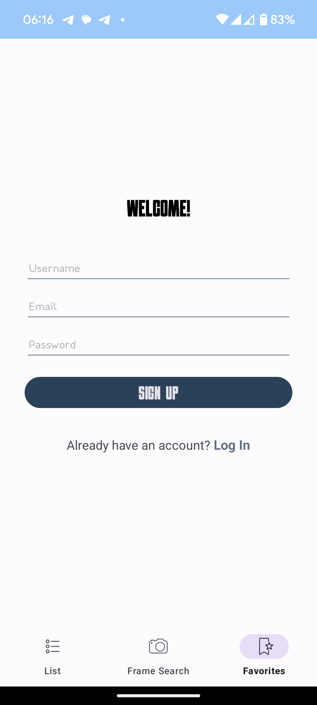

# AniFrame


AniFrame is a mobile application designed for anime enthusiasts to discover, track, and manage their favorite anime series. With a sleek and intuitive interface, AniFrame provides users with a seamless experience for exploring the vast world of anime. The app features three main fragments: Anime List, Search by fragment, and Favorites. It integrates with the Kitsu API for anime data, utilizes Sorulysearch for efficient search functionality, and employs Room Database for managing favorite anime selections.

## Table of Contents

- [Introduction](#introduction)
- [Features](#features)
- [Screenshots](#screenshots)
- [Getting Started](#getting-started)
  - [Prerequisites](#prerequisites)
  - [Installation](#installation)
- [Usage](#usage)
- [Built With](#built-with)
- [Authors](#authors)


## Introduction

AniFrame offers anime enthusiasts a comprehensive platform to discover, explore, and manage their favorite anime series. The application includes three primary fragments:

- **Anime List:** Access a vast library of anime series, movies, and OVAs sourced from the Kitsu API. Browse through trending anime, search for specific titles, or explore by genre.
- **Search:** Utilize the Sorulysearch feature to efficiently search across all fragments, enabling users to quickly find the anime they're looking for.
- **Favorites:** Manage your favorite anime series with ease using the Favorites fragment. Utilizing Room Database, AniFrame allows users to save and organize their preferred selections locally on their device.

## Features

- **Comprehensive Anime Database:** Access a wide range of anime series, movies, and OVAs from the Kitsu API.
- **Efficient Search Functionality:** Utilize Sorulysearch to quickly search for anime titles across all fragments.
- **Favorites Management:** Save and organize favorite anime selections locally using Room Database.
- **User Authentication:** Secure user authentication ensures that only authorized users can access certain features, such as adding anime to favorites.
- **MVVM Architecture:** Employing the Model-View-ViewModel architecture for robust, maintainable, and testable code.
- **Coroutines:** Utilizing Kotlin Coroutines for managing background threads, making the app responsive.
- **Retrofit:** Using Retrofit for efficient and easy-to-use HTTP client for Android.

## Screenshots
<div style="display: inline-block;">
  
  
  
  
  
  
  
</div>


## Getting Started

### Prerequisites

- Android SDK version 29 or higher
- Android Build Tools version 29.0.3
- The latest version of Android Studio

### Installation

1. **Clone the repository:**

    ```bash
    git clone https://github.com/Tasherokk/Android-Project/AniFrame.git
    ```

2. **Open the project in Android Studio.**
3. **Build and run the project on your device or emulator.**
4. **APK: link**

## Usage

1. **Launch the AniFrame application on your Android device.**
2. **Navigate through the Anime List, Search, and Favorites fragments to explore anime content and manage your favorites.**
3. **Utilize the search functionality to quickly find specific anime titles.**
4. **Interact with the Kitsu API-integrated Anime Details page to view detailed information about specific anime series.**
5. **Add anime selections to your Favorites list for easy access and organization.**
6. **If prompted, log in with your credentials to access additional features and user-specific functionality.**

## Built With

- **Android Studio**
- **Kotlin**
- **Kitsu API : https://hummingbird-me.github.io/api-docs/**
- **Sorulysearch : https://github.com/soruly/trace.moe?tab=readme-ov-file**
- **Room Database**
- **SharedPreferences**
- **MVVM Architecture**
- **Kotlin Coroutines**
- **Retrofit**


## Authors

- Saduakhas Olzhas
- Sazanova Aruzhan
- Kobeisinuly Kuanysh

